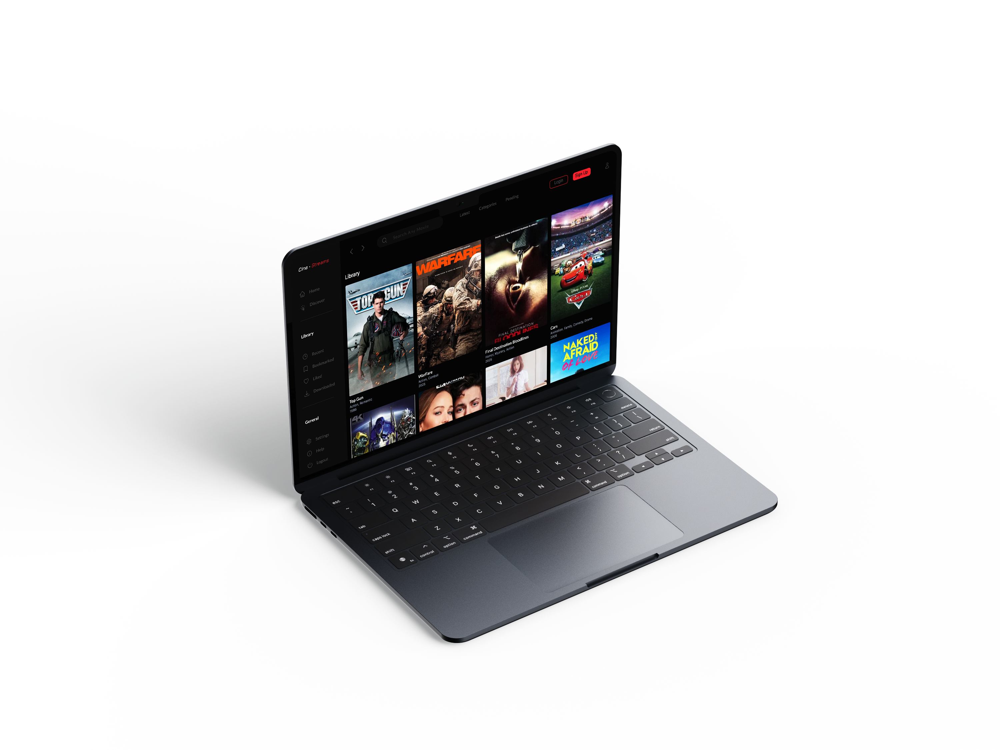

## React | Typescript | TailwindCSS Movie Site ##

### Overview: ###

#### A responsive and stylish movie dashboard built with React and Tailwind CSS. This app displays a grid of movies with posters, titles, genres, and other details. It includes a sidebar, search bar, navigation, and account section. ####

## Features
### The site includes several key features aimed at enhancing task management and user experience: ###

- **Search bar** to explore the movie library
- **Responsive movie grid layout** using Tailwind CSS
- **Sidebar drawer** for navigation or filtering
- **Movie details** with title, genre, year, and poster

 #### These features will be available on upcoming updates ####
 

## Technologies Used: ##

| Technology      | Purpose                                      |
|------------------|----------------------------------------------|
| **React**        | JavaScript library for building UI           |
| **TypeScript**   | Type safety and better development workflow  |
| **Tailwind CSS** | Utility-first CSS framework for styling      |
| **Vite**         | Lightning-fast development server and build  |
| **JSON**         | Static data source for movie entries         |
 

###### © 2025 Cine.Stream - Binada Hettiarachchi. All Rights Reserved. ######
